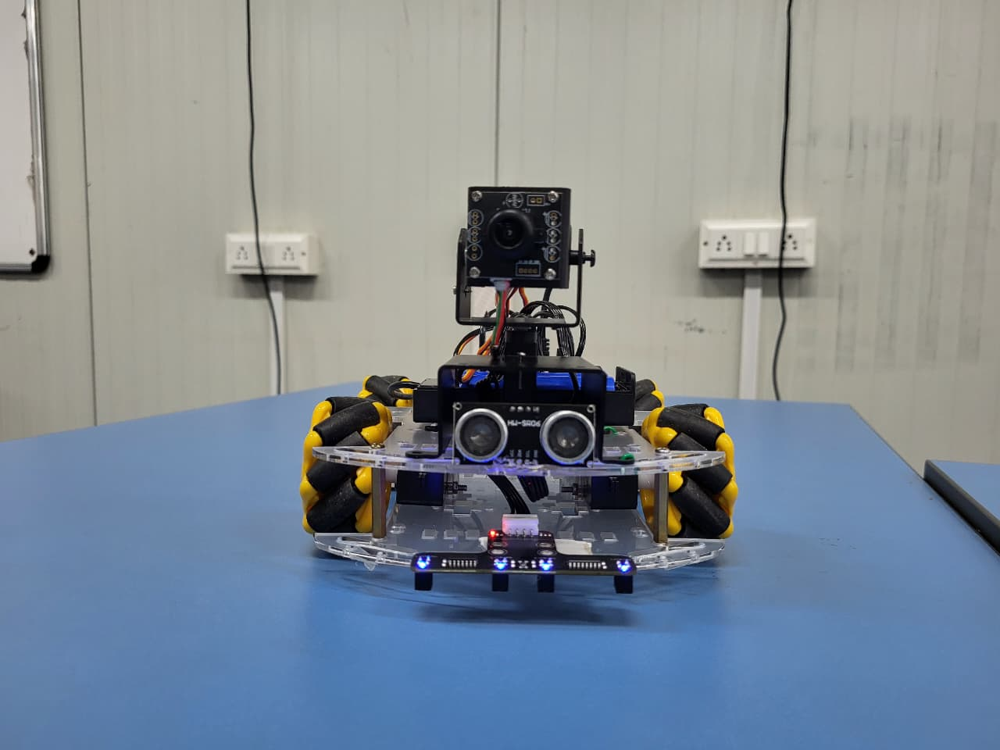
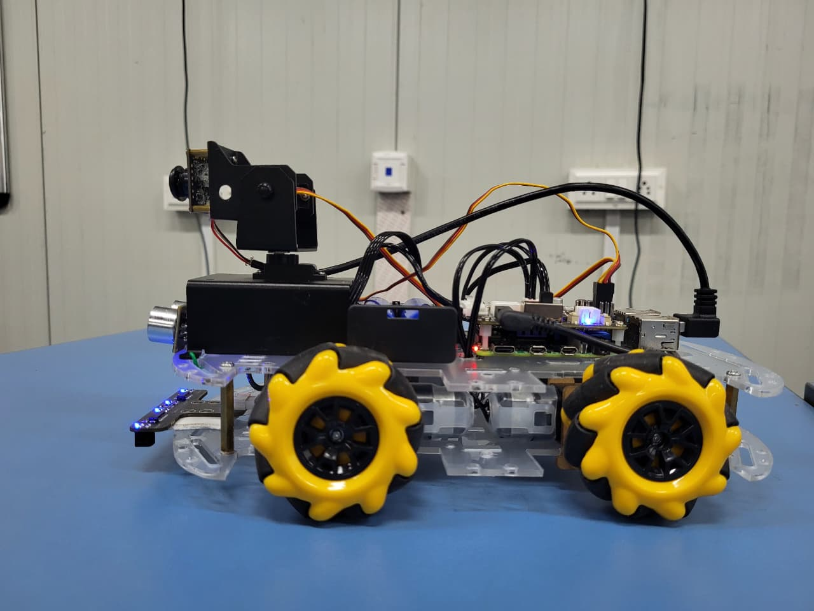
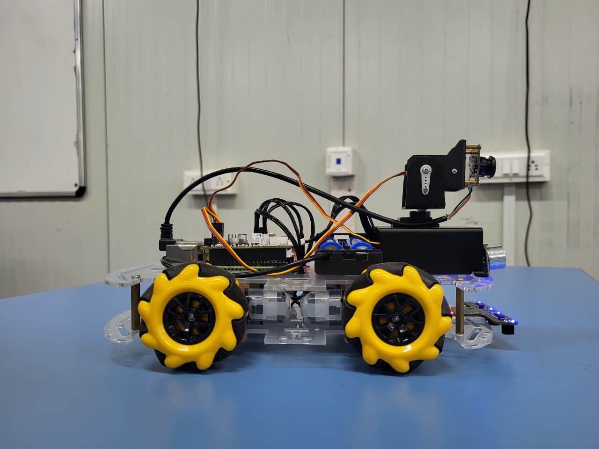

# Omnisight — Omnidirectional Vision-Guided Autonomous Robot

[](https://docs.ros.org/en/humble/)
[](https://gazebosim.org/)
[](https://python.org)
[](LICENSE)
[](https://www.raspberrypi.com/)

> **Capstone Project — VIT Bhopal University | SEEE | B.Tech ECE (AI & Cybernetics) | 2022–2026**
>
> Submitted by: **Jay Hepat** (22BAC10040) · **Vivek Kumar Vishwakarma** (22BAC10036) · **Shiv Pratap Singh** (22BAC10029)
>
> Supervisor: **Dr. Soumitra K. Nayak**, Assistant Professor, SEEE

---

## 📌 Project Overview

**Omnisight** is an autonomous indoor surveillance and patrol robot built on a
**Mecanum-wheel chassis** (omnidirectional movement) controlled by a
**Raspberry Pi 4B** running **ROS2 Humble**. The robot autonomously patrols
indoor environments, detects intruders using face recognition, monitors scene
changes, avoids obstacles, and wirelessly transmits alerts to a monitoring PC.

<p align="center">
  
  
  
</p>

---

## 🎯 Key Features

| Feature | Implementation |
|---------|---------------|
| 360° Omnidirectional motion | 4× Mecanum wheels + PCA9685 PWM driver |
| Autonomous patrol | ROS2 state machine (7 nodes) |
| Face recognition | MediaPipe + face_recognition library |
| Obstacle avoidance | HC-SR04 ultrasonic — threshold-based reactive |
| Scene change detection | OpenCV SSIM on door / window / object zones |
| 2-DOF camera scanning | Pan-tilt servo head (GPIO 23 & 24) |
| Wireless alerting | TCP socket → PC receiver with image snapshots |
| Path planning | Hybrid RRT + D* Lite (global + dynamic replanning) |
| SLAM | ORB-SLAM2 for simultaneous localisation and mapping |
| Gazebo simulation | Full 3D sim — Ignition Fortress + ROS2 Humble |

---

## 🗂️ Repository Structure

```
Omnisight/
│
├── 📄 README.md                          ← You are here
├── 📄 LICENSE
│
├── 📁 ros2_ws/                           ← Robot description (URDF + meshes)
│   └── src/mec_omnisight/
│       ├── mec_omnisight/                ← Metapackage
│       └── mec_omnisight_description/    ← URDF, xacros, STL meshes
│           ├── urdf/robots/              ← robot_3d.urdf.xacro (main)
│           ├── urdf/mech/                ← chassis + mecanum wheel xacros
│           ├── urdf/sensors/             ← lidar, camera, imu xacros
│           └── meshes/                   ← STL files for Gazebo/RViz
│
├── 📁 phase1/                            ← Real-hardware patrol system
│   ├── README.md
│   └── omnisight_ws/src/omnisight_patrol/
│       ├── omnisight_patrol/             ← 7 ROS2 Python nodes
│       │   ├── patrol_master.py          ← State machine brain
│       │   ├── motion_control.py         ← Mecanum wheel kinematics
│       │   ├── obstacle_avoidance.py     ← Ultrasonic watchdog
│       │   ├── pan_tilt_scanner.py       ← 2-DOF servo sweep
│       │   ├── scene_monitor.py          ← SSIM change detection
│       │   ├── face_recognition_node.py  ← Stranger detection
│       │   └── alert_manager.py          ← WiFi TCP + buzzer
│       ├── launch/patrol_system.launch.py← One-command launch
│       ├── config/patrol_waypoints.yaml  ← All settings
│       ├── config/omnisight_room.xml     ← Room map + 16 waypoints
│       └── monitoring_client/pc_receiver.py ← Run on your PC
│
├── 📁 phase2/                            ← Gazebo simulation (ROS2 Humble)
│   ├── README.md
│   └── omnisight_simulation/src/omnisight_sim/
│       ├── launch/simulation.launch.py   ← Full Gazebo + RViz2 launch
│       ├── launch/display.launch.py      ← RViz2 URDF viewer only
│       ├── worlds/omnisight_indoor.world ← 8×6m office world
│       └── rviz/                         ← RViz2 config files
│
├── 📁 media/                             ← Robot photos & demo videos
│   ├── hardware/                         ← Build photos
│   ├── results/                          ← Testing result images
│   └── demo/                             ← Demo videos
│
├── 📁 docs/                              ← Project reports & presentations
│
└── 📁 cad_models/                        ← STL files of individual parts
```

---

## 🚀 Quick Start

### Phase 1 — Run on Real Hardware (Raspberry Pi)

**Step 1** — On your PC, start the monitoring receiver:
```bash
cd phase1/omnisight_ws/src/omnisight_patrol/monitoring_client
python3 pc_receiver.py
# Note the IP shown (e.g. 192.168.1.100)
```

**Step 2** — On the Raspberry Pi, edit the IP in config:
```bash
# Edit phase1/omnisight_ws/src/omnisight_patrol/config/patrol_waypoints.yaml
monitoring_device_ip: "192.168.1.100"
```

**Step 3** — Add authorised face photos:
```
phase1/omnisight_ws/src/omnisight_patrol/config/known_faces/
  └── yourname.jpg   (one photo per person)
```

**Step 4** — Build and launch:
```bash
cd ~/phase1/omnisight_ws
colcon build --packages-select omnisight_patrol
source install/setup.bash
ros2 launch omnisight_patrol patrol_system.launch.py
```

Robot starts patrolling automatically in **5 seconds** ✅

> Set `simulation_mode: true` in the YAML to test without hardware.

---

### Phase 2 — Run Gazebo Simulation (Ubuntu 22.04 + ROS2 Humble)

**Step 1** — Build robot description first:
```bash
cd ~/ros2_ws
colcon build
source install/setup.bash
```

**Step 2** — Build and launch simulation:
```bash
cd ~/phase2/omnisight_simulation
colcon build
source install/setup.bash
ros2 launch omnisight_sim simulation.launch.py
```

**Step 3** — Teleoperate in simulation:
```bash
ros2 run teleop_twist_keyboard teleop_twist_keyboard
```

---

## 🧠 System Architecture

### Phase 1 — Node Communication

```
                    ┌──────────────────────────┐
                    │      patrol_master        │
                    │  (IDLE→PATROL→RETURN→WAIT)│
                    └───┬──────┬──────┬─────────┘
                        │      │      │
          /target_waypoint  /patrol_state  /pantilt_preset
                        │      │      │
           ┌────────────▼─┐  ┌─▼──────▼────────┐
           │motion_control│  │pan_tilt_scanner  │
           │(mecanum IK)  │  │(2-DOF servo head)│
           └──────┬───────┘  └─────────────────┘
                  │ /waypoint_reached
                  │
     ┌────────────┴──────────────────────────────┐
     │          obstacle_avoidance                │
     │   (HC-SR04 → /obstacle_detected)          │
     └───────────────────────────────────────────┘
                  │
     ┌────────────┴──────────────────────────────┐
     │  scene_monitor + face_recognition_node    │
     │  (OpenCV SSIM + MediaPipe)                │
     └─────────────────────┬─────────────────────┘
                           │
                  ┌────────▼────────┐
                  │  alert_manager  │
                  │  (TCP → PC)     │
                  └─────────────────┘
```

### Phase 2 — Simulation Data Flow

```
Ignition Gazebo
  ├── LiDAR  ──────────────────→ /scan           (LaserScan)
  ├── RGBD Camera ──────────────→ /cam_1/image   (Image)
  ├── IMU ────────────────────→ /imu/data        (Imu)
  ├── Odometry ───────────────→ /odom            (Odometry)
  └── TF ─────────────────────→ /tf              (TFMessage)
                       ↑
              /cmd_vel (Twist) → robot moves
```

---

## 📷 Results

| Obstacle Avoidance | Omnidirectional Motion |
|---|---|
| *(see media/results/)* | *(see media/results/)* |

| Color Recognition | Hardware Integration |
|---|---|
| *(see media/results/)* | *(see media/hardware/)* |

> 🎬 **Demo video:** `media/demo/Autonomously_ObstacleAvoidance_Test.mp4`

---

## 🛠️ Hardware Components

| Component | Model | Notes |
|-----------|-------|-------|
| Main controller | Raspberry Pi 4B (4GB) | Runs ROS2 + all nodes |
| Chassis | Mecanum wheel platform | 4-wheel omnidirectional |
| Motor driver | PCA9685 (I2C 0x40) | PWM-based DC motor control |
| Drive motors | DC gear motors ×4 | FL/FR/RL/RR |
| Camera | Pi Camera Module v2 | OpenCV vision processing |
| Distance sensor | HC-SR04 ultrasonic | TRIG: GPIO18, ECHO: GPIO24 |
| Pan-tilt servos | SG90 ×2 | GPIO 23 (pan), GPIO 24 (tilt) |
| Buzzer | Passive buzzer | GPIO17 |
| Battery | LiPo 12V pack | Powers motors + Pi |

---

## 💻 Software Stack

| Layer | Technology |
|-------|-----------|
| OS | Ubuntu 22.04 (Pi) / Ubuntu 22.04 (PC) |
| Robotics framework | ROS2 Humble |
| Simulation | Ignition Gazebo Fortress |
| Vision | OpenCV 4, MediaPipe |
| SLAM | ORB-SLAM2 |
| Path planning | RRT + D* Lite (hybrid) |
| Obstacle avoidance | DWA + VFH (hybrid) |
| Navigation | ROS2 Nav2 |

---

## 📚 References

1. R. Mur-Artal et al., "ORB-SLAM: A Versatile and Accurate Monocular SLAM System," *IEEE Trans. Robotics*, 2015.
2. S. Koenig and M. Likhachev, "D* Lite," *AAAI Conference on AI*, 2002.
3. S. M. LaValle, "Rapidly-Exploring Random Trees: A New Tool for Path Planning," Iowa State Univ., 1998.
4. J. Borenstein and Y. Koren, "The Vector Field Histogram," *IEEE Trans. Robotics*, 1991.
5. D. Fox, W. Burgard, S. Thrun, "The Dynamic Window Approach to Collision Avoidance," *IEEE RA Magazine*, 1997.
6. S. Macenski et al., "The ROS 2 Navigation Stack (Nav2)," *IROS*, 2020.

---

## 📄 License

BSD-3-Clause © 2026 VIT Bhopal University — SEEE Capstone Group 15
